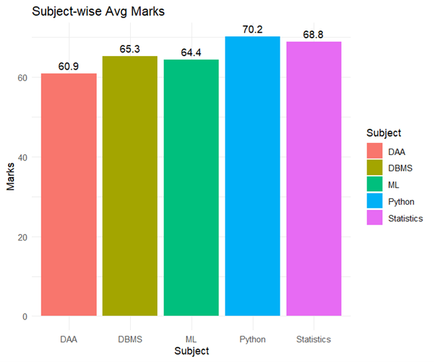
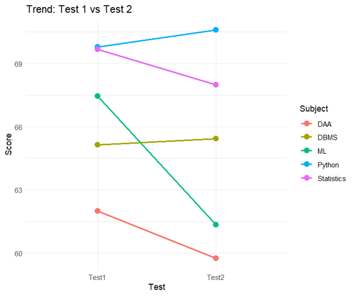
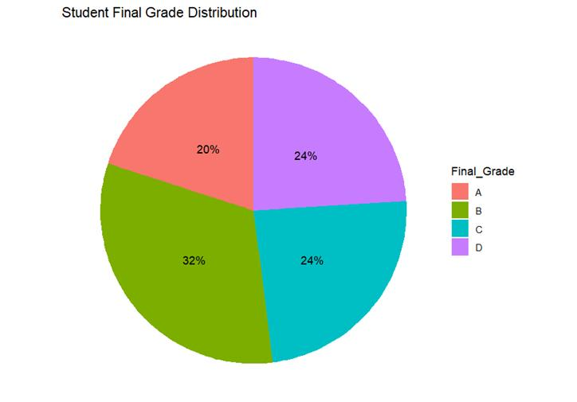

# Experiment 1: Student Performance Analysis

**Roll No:** 23BAD083

## Objective
Perform Exploratory Data Analysis (EDA) on student performance data to understand academic trends and grade distributions.

## Dataset
**File:** `1.student_performance.csv`

The dataset contains 52 records of student academic performance with the following attributes:
| Column | Description |
|--------|-------------|
| Student_ID | Unique identifier for each student |
| Department | Department (IT, AI&DS, CSE) |
| Semester | Current semester (5, 6, 7) |
| Subject | Subject name (Statistics, DAA, ML, Python) |
| Internal_Test1 | Marks in Internal Test 1 |
| Internal_Test2 | Marks in Internal Test 2 |
| Assignment_Marks | Assignment marks |
| Attendance_Percentage | Student attendance percentage |
| Final_Grade | Final grade awarded (A, B, C, D) |

## Libraries Used
- `ggplot2` - Data visualization
- `dplyr` - Data manipulation
- `tidyr` - Data tidying

## Analysis Performed

### 1. Subject-wise Average Marks (Bar Chart)
Calculates and visualizes the average internal test marks for each subject.



### 2. Performance Trend Analysis (Line Chart)
Compares performance trends between Internal Test 1 and Internal Test 2 across different subjects.



### 3. Final Grade Distribution (Pie Chart)
Shows the distribution of final grades among students.



## How to Run
1. Ensure R is installed on your system
2. Install required packages:
   ```r
   install.packages(c("ggplot2", "dplyr", "tidyr"))
   ```
3. Update the file path in the script to match your local directory
4. Run `EDA_ass_1.R` in RStudio or R console

## Output
Generated visualizations are saved in the `figures/` folder.
