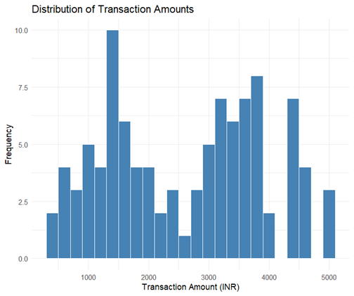
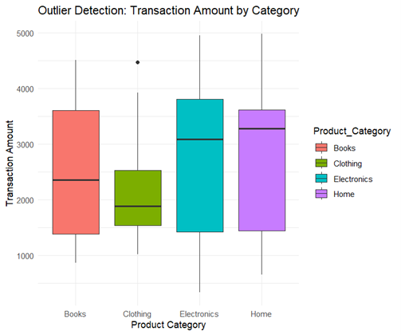
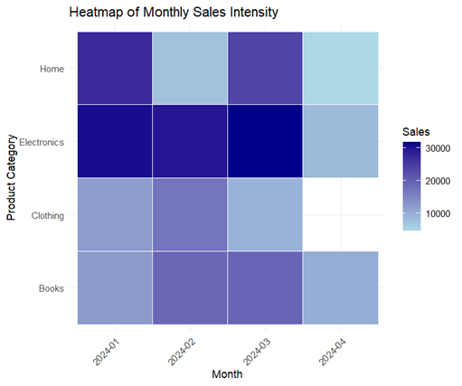

# Experiment 2: E-Commerce Transaction Analysis

**Roll No:** 23BAD083

## Objective
Perform Exploratory Data Analysis (EDA) on e-commerce transaction data to understand sales patterns, detect outliers, and visualize monthly sales intensity.

## Dataset
**File:** `2.ecommerce_transactions.csv`

The dataset contains 102 transaction records with the following attributes:
| Column | Description |
|--------|-------------|
| Transaction_ID | Unique identifier for each transaction |
| Customer_ID | Customer identifier |
| Transaction_Date | Date of transaction |
| Product_Category | Category (Books, Electronics, Home) |
| Transaction_Amount | Amount in INR |
| Payment_Mode | Payment method (Card, UPI, NetBanking) |
| Region | Geographic region (North, South, East, West) |

## Libraries Used
- `ggplot2` - Data visualization
- `dplyr` - Data manipulation
- `lubridate` - Date/time handling

## Analysis Performed

### 1. Transaction Amount Distribution (Histogram)
Visualizes the frequency distribution of transaction amounts across all purchases.



### 2. Outlier Detection by Category (Box Plot)
Identifies outliers in transaction amounts for each product category using box plots.



### 3. Monthly Sales Intensity (Heatmap)
Displays the total sales intensity across months and product categories using a heatmap visualization.



## How to Run
1. Ensure R is installed on your system
2. Install required packages:
   ```r
   install.packages(c("ggplot2", "dplyr", "lubridate"))
   ```
3. Update the file path in the script to match your local directory
4. Run `EDA_ass_2.R` in RStudio or R console

## Output
Generated visualizations are saved in the `figures/` folder.
