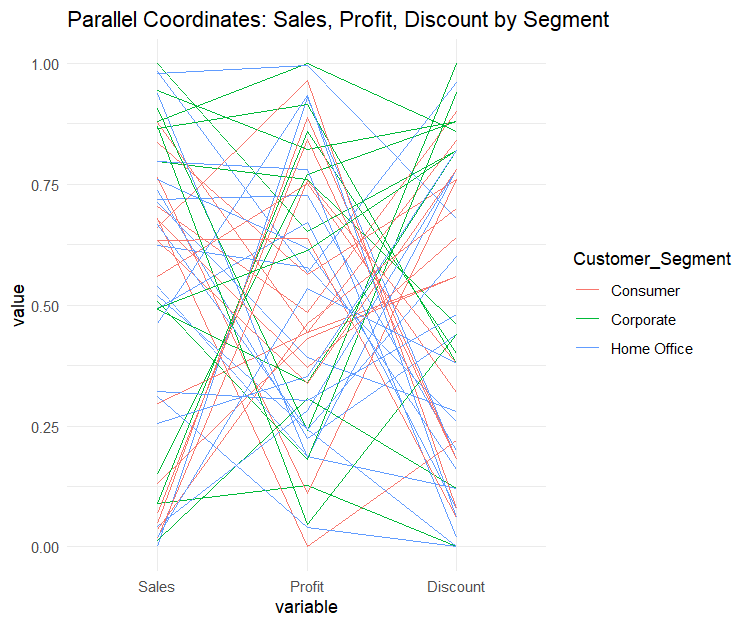
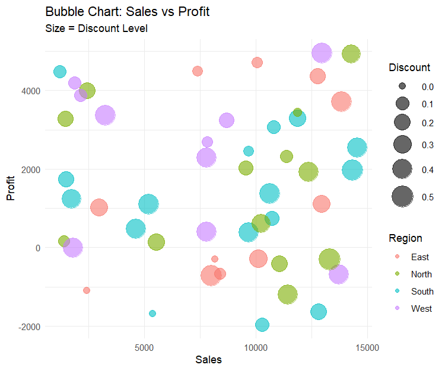
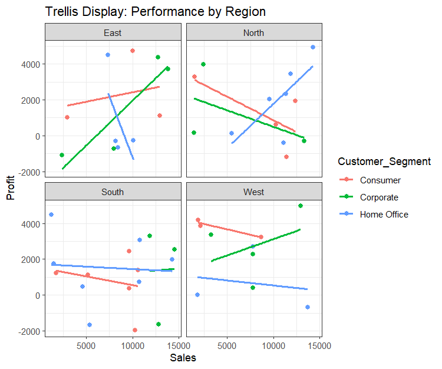

# Experiment 6: Retail Business Data Analysis

**Name:** POOJITH M  
**Roll No:** 23BAD083

## Objective
Perform comprehensive EDA on retail business data using advanced visualization techniques to analyze sales performance, profit margins, and customer segments across different regions.

## Dataset
**File:** `6.retail_business.csv`

The dataset contains 52 retail transaction records with the following attributes:
| Column | Description |
|--------|-------------|
| Order_ID | Unique identifier for each order |
| Region | Geographic region (North, South, East, West) |
| Product_Category | Product type (Office Supplies, Furniture, Technology) |
| Sales | Sales amount |
| Profit | Profit amount |
| Discount | Discount percentage |
| Customer_Segment | Customer type (Corporate, Consumer, Home Office) |

## Libraries Used
- `ggplot2` - Data visualization
- `GGally` - Extended ggplot2 functionality
- `dplyr` - Data manipulation

## Analysis Performed

### 1. Parallel Coordinates Plot
Visualizes Sales, Profit, and Discount metrics across different customer segments using parallel coordinates.



### 2. Bubble Chart - Sales vs Profit
Interactive bubble chart showing:
- **X-axis:** Sales
- **Y-axis:** Profit
- **Bubble Size:** Discount Level
- **Color:** Region



### 3. Trellis Display - Performance by Region
Faceted scatter plots with trend lines showing Sales vs Profit relationships across different regions and customer segments.



## Key Findings
- Parallel coordinates reveal sales-profit-discount patterns by customer segment
- Bubble chart identifies profit anomalies and discount effectiveness
- Trellis display shows regional performance differences
- Trend lines indicate sales-profit correlation strength by region

## How to Run
1. Ensure R is installed on your system
2. Install required packages:
   ```r
   install.packages(c("ggplot2", "GGally", "dplyr"))
   ```
3. Update the file path in the script to match your local directory
4. Run `EDA_ass_6.R` in RStudio or R console

## Output
Generated visualizations are saved in the `Figures/` folder.
